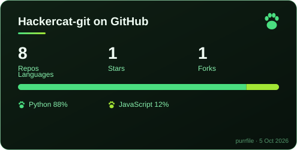

# Hey, I'm Hackercat 🐾

**Builder · Tinkerer · Security Enthusiast**

Student developer from the Netherlands — building open-source tools, running a homelab,
and growing [ByteBellSoftware](https://github.com/ByteBellSoftware) into something real.

---

## 🐾 GitHub Stats

---

## 🛠️ Projects

### 📊 [PurrFileGenerator](https://github.com/Hackercat-git/PurrFileGenerator)
Generate an animated SVG stats card for any GitHub profile.
Zero dependencies · 15 themes · 15 palettes · automatic dark/light mode

### 🖥️ [Purrmox](https://github.com/Hackercat-git/Purrmox)
Personal status dashboard for Proxmox homelab clusters.

### 🕵️ [Pawprint](https://github.com/Hackercat-git/Pawprint)
Turns nmap scan output into clean, readable HTML reports.

### 🎨 [Catscii](https://github.com/Hackercat-git/Catscii)
Turn any image into ASCII art — multiple styles, optional color output, HTML export.

---

## 🧰 Tech Stack

**Languages**

**Frameworks & Libraries**

**Databases & Infra**

---

## 🖥️ Homelab

Running a personal Proxmox cluster with 18 active containers — Discord bots, reverse proxies, local AI inference, monitoring, and more.

---

## 🔐 Cybersecurity

Actively learning offensive and defensive security through hands-on platforms.

**Working toward:** CompTIA Security+ &nbsp;·&nbsp; Network+ &nbsp;·&nbsp; CEH

---

## 🏢 ByteBellSoftware

I run [ByteBellSoftware](https://github.com/ByteBellSoftware) — a small software org where I build and maintain tools, with the goal of turning it into something bigger.

---

*Card auto-updates daily via GitHub Actions · built with [PurrFileGenerator](https://github.com/Hackercat-git/PurrFileGenerator)*

